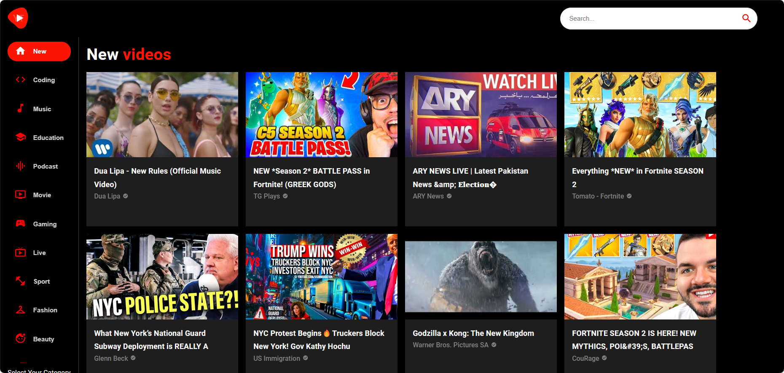
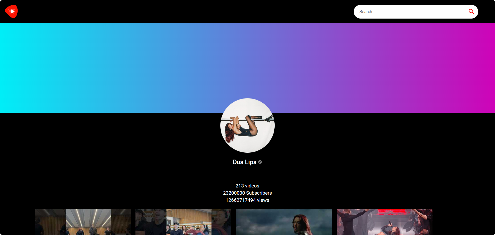
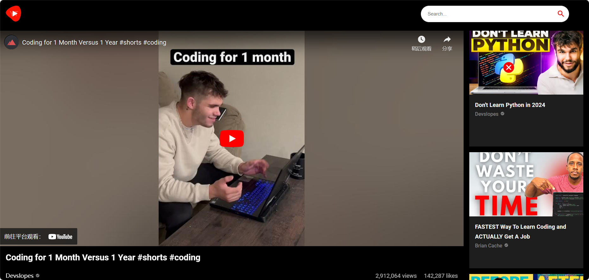

# ViewTube Project

ViewTube is a React project inspired by YouTube, utilizing Material UI for UI components and integrating RapidAPI for fetching YouTube data. This project aims to provide a simplified version of YouTube, allowing users to browse, search, and view YouTube videos within the application.

## Technology Used
React: Most popular frontend framework is used to quickly build reusable components and integrate HTML, CSS and JavaScript for building user interfaces.

Material UI: More styled React components library for designing UI elements.

RapidAPI: A Quick API platform used for fetching YouTube data.

## Features
Browsing: Users can browse through a list of popular videos.

Search: Search functionality allows users to find videos based on keywords.

Video Playback: Users can watch videos directly within the application.

Responsive Design: The application is designed to be responsive across various devices.

## Deployment
1. Clone the repository: git clone https://github.com/XiandaDu/ViewTube
2. Navigate to the project directory: cd ~/PathToYour/ViewTube
3. Install dependencies: npm install
4. Start the development server: npm run start
5. Open your browser and visit http://localhost:3000 to view the application. 
You can also change the port by configuring the package.json file. 

## Available Scripts

In the project directory, you can run:

### `npm run start`

Runs the app in the development mode.\
Open [http://localhost:3000](http://localhost:3000) to view it in your browser.

The page will reload when you make changes.\
You may also see any lint errors in the console.

### `npm run test`

Launches the test runner in the interactive watch mode.\
See the section about [running tests](https://facebook.github.io/create-react-app/docs/running-tests) for more information.

### `npm run build`

Builds the app for production to the `build` folder.\
It correctly bundles React in production mode and optimizes the build for the best performance.

The build is minified and the filenames include the hashes.\
Your app is ready to be deployed!

See the section about [deployment](https://facebook.github.io/create-react-app/docs/deployment) for more information.

## Porject Structure
```
ViewTube/
│
├── public/
│   ├── index.html
│   ├── logo.png
│   └── favicon.ico
│
├── src/
│   ├── components/
│   │   ├── Video.jsx
│   │   ├── SearchBar.jsx
│   │   └── ...
│   ├── utils/
│   │   ├── constant.js
│   │   └── fetchFromAPI.js
│   ├── App.js
│   ├── index.css
│   └── index.js
│
├── README.md
├── LICENSE
└── package.json
```

## Demo
New Videos


Channel Details


Video Player



## License
MIT

## Disclaimer
This project is an independent development created solely for learning purposes, aiming to showcase my skills and experience. It is not an official product of YouTube or affiliated with YouTube company. This project is intended for educational and technical demonstration purposes only and has not been endorsed or authorized by YouTube company. I commit to compliance with all applicable laws and regulations and respect the intellectual property and privacy rights of others. If you believe there are any issues with this project, please feel free to contact me for further discussion.
